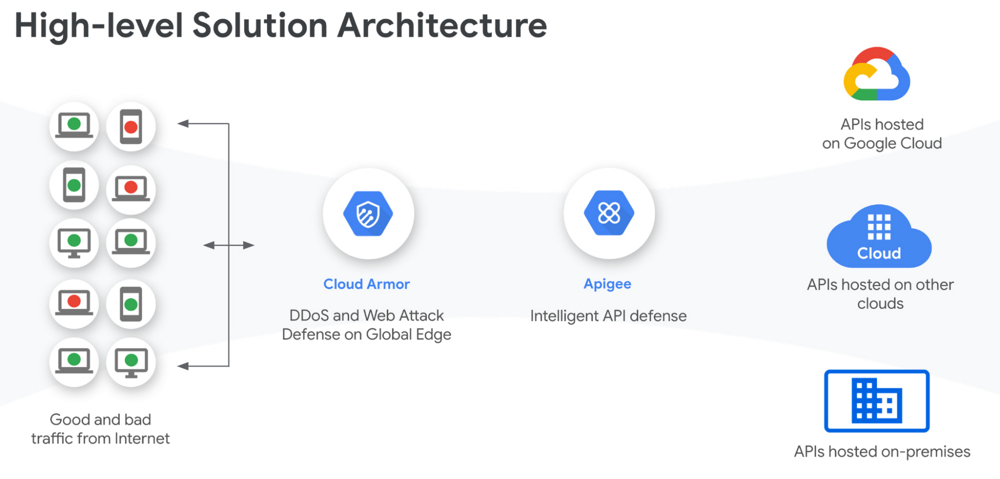
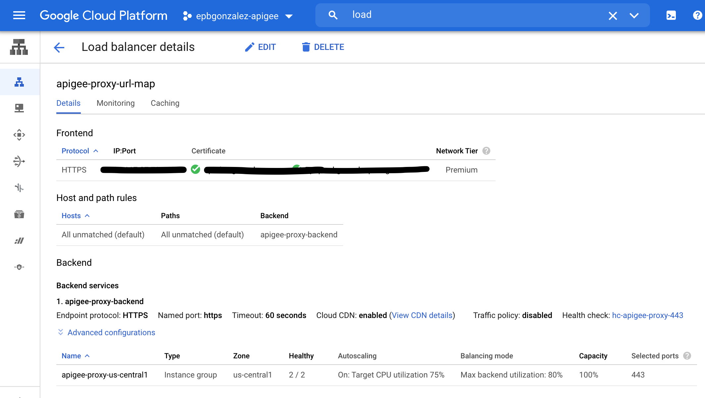
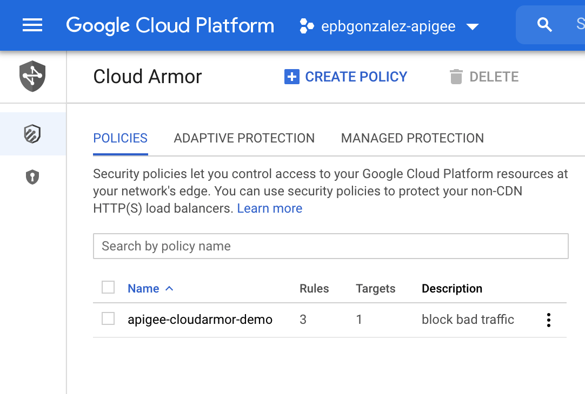
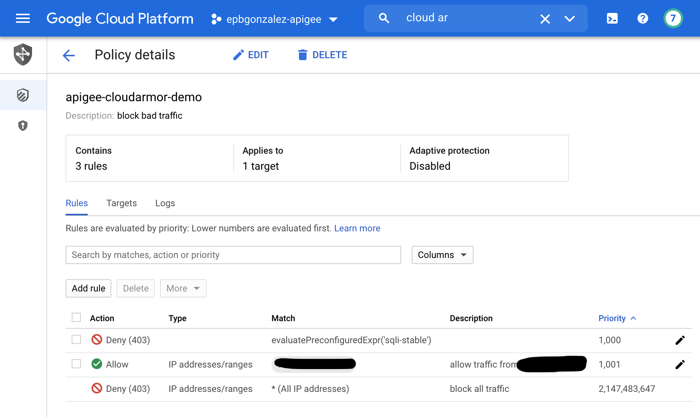

# apigee-cloudarmor-cdn-demo

This repo contains a script that will enable caching and will add a security layer in front of [Apigee](https://cloud.google.com/apigee/docs) leveraging [Cloud CDN](https://cloud.google.com/cdn) and [Cloud Armor](https://cloud.google.com/armor).

## Prerequisites

* An Apigee org is provisioned. See [here](https://cloud.google.com/apigee/docs/api-platform/get-started/overview) for instructions. 
* gcloud CLI is installed
* a previously configured [Google Cloud Load Balancer](https://cloud.google.com/load-balancing/docs/https). You can use this repository to configure it: [Git](https://github.com/egonzalezpozega/apigee-network-bridge)

## Architecture

The Apigee service when provisioned on GCP is by default only available as a private service (behind an internal load balancer). When exposed through an external Load Balancer to the public internet now you can take advantage of Cloud Armor to protect your APIs from DDoS attacks and other malicious traffic and take advantage of global caching by using Cloud CDN. 



## How to use

Run the script providing the GCP Project ID where your Apigee org lives as an argument.

```bash
./setup-cloudarmor-cdn.sh <your_project_id> <your_destination_directory>
```

The script assumes you have followed the steps on [Git](https://github.com/egonzalezpozega/apigee-network-bridge) to setup the external loadbalancer with the backend name "apigee-proxy-backend". If you used a different backend name, feel free to pass it to the script as a second parameter.

```bash
./setup-cloudarmor-cdn.sh <your_project_id> <your_apigee_backend>
```

This will create a sample security-policy in Cloud Armor called apigee-cloudarmor-demo and will add 2 rules to it:
* A rule to only allow traffic from your public IP. (It uses the service ifconfig.me)
* A rule with a predefined expression to prevent SQL injection attacks.


## Verify that the setup worked

Go to your GCP console and check:

Under your Cloud Load Balancer details that CDN is enabled for the Apigee proxy backend service:



Under Cloud Armor there should be a new security policy called apigee-cloudarmor-demo with 3 rules:




You can import the following sample proxy into Apigee to test that everything is working correctly. It includes the Cache-control headers for CDN. 

[Hello World Proxy](./helloworld_proxy.zip)

## Testing CDN

You should now be able to make API calls from your IP to https://{yourapiproxyurl}/helloworld and they will be cached for 60s. Any subsequent requests after the first API call should take less than the first one. 

## Testing Cloud Armor security policy

If you try to query the API from any another public IP, for example from another VM in GCP, you should get a status code 403 (Forbidden).
If you try to query the API and provide an SQL delete statement as a query parameter your call will be blocked by Cloud Armor and you should also get a status code 403 (Forbidden).

Sample SQL injection query:

```bash
curl -v 'https://{yourapiproxyurl}/helloworld?param=delete%20*%20from%20users;'
```

___

## Support

This is not an officially supported Google product